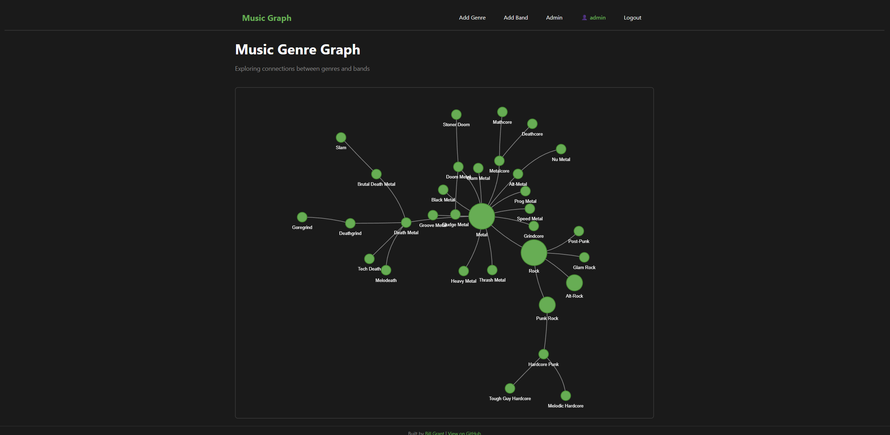
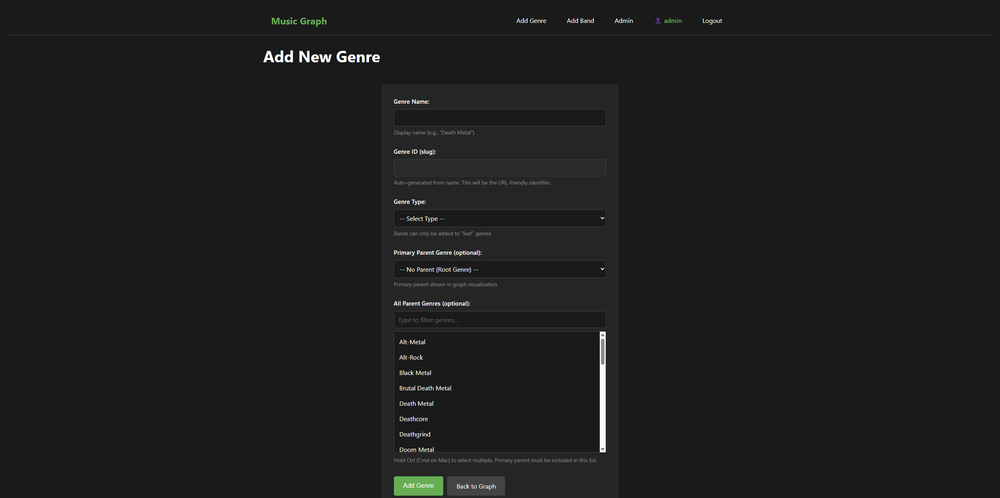
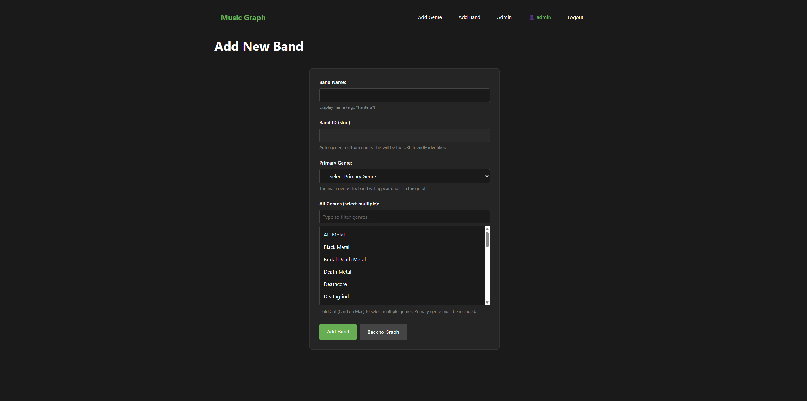
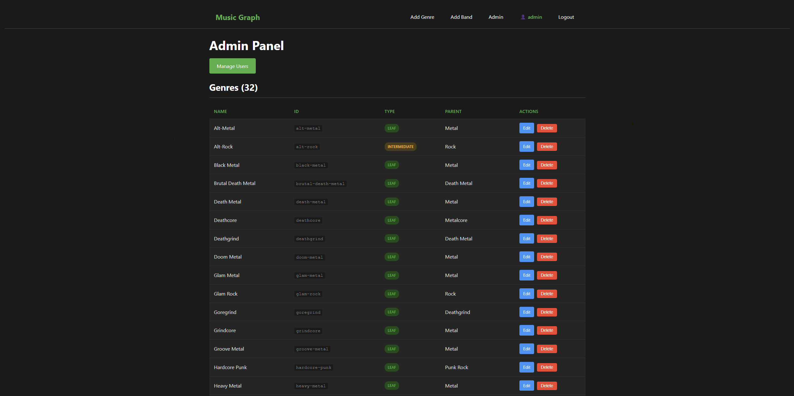

***Tonight Claude and I made some UI/UX improvements based on feedback from our single user. He wanted some pretty logical things. Search box was one, alphabetical order in the admin menus, and a change in the size of the nodes based on type. We uncovered an issue with our tests when running the app locally and we refactored something that has been bothering me. We were converting the data in postgres to dict and it was no longer needed. The screenshot below show off the new UI. Ater that the post was writtent by Claude***

## Screenshots









---

### Phase 8 focuses entirely on user experience improvements based on feedback from Aidan (the primary user). After several weeks of actually using the application, he identified specific pain points that we addressed in this phase.

## User Feedback Drives Development

Having a real user is invaluable. Aidan's feedback was specific and actionable:

1. **"The graph only takes up half the screen"** - leftover from early development when we had debug boxes below it
2. **"All the genre circles are the same size"** - hard to see the hierarchy visually
3. **"The genre lists aren't alphabetical"** - frustrating to find specific genres
4. **"The selection boxes are too small"** - hard to see options when selecting multiple genres
5. **"I can't search/filter the genre list"** - scrolling through a long list is tedious
6. **"There's no way to contact you"** - needed a footer with links

Each of these came from actually using the app, not from theoretical design discussions.

## Graph Improvements

### Viewport-Relative Sizing

The graph container was hardcoded to 600px height:

```css
/* Before */
#network-graph {
    height: 600px;
}
```

This wasted screen space on larger monitors. The fix uses viewport units:

```css
/* After */
#network-graph {
    height: calc(100vh - 320px);
    min-height: 400px;
}
```

Now the graph fills available space regardless of screen size. The `320px` offset accounts for the navbar, title, and footer. The `min-height` ensures it doesn't get too small on tiny screens.

### Node Sizing by Hierarchy

All genre nodes were the same size, making it hard to visually identify the hierarchy. We added size based on genre type:

```javascript
// In the Jinja template

size: 402515

```

This required two changes:
1. Pass the `type` field to the template (we were already querying it, just not passing it)
2. Change from `circle` shape to `dot` shape in vis.js

The `circle` shape in vis.js auto-sizes based on label length. The `dot` shape respects the explicit `size` property. This also moves labels below the nodes rather than inside them - a change Aidan actually preferred.

## Form Improvements

### Alphabetical Sorting

Every genre query in `app.py` needed `.order_by(Genre.name)` added:

```python
# Before
genres = Genre.query.filter_by(type='leaf').all()

# After
genres = Genre.query.filter_by(type='leaf').order_by(Genre.name).all()
```

This touched about 12 different queries across the add/edit genre and band routes. A bit tedious but straightforward.

### Client-Side Filtering

The multi-select dropdowns now have a filter input above them. Type to filter the list in real-time.

The JavaScript is simple but effective:

```javascript
// filter.js
document.addEventListener('DOMContentLoaded', function() {
    const filterInputs = document.querySelectorAll('.genre-filter');

    filterInputs.forEach(function(input) {
        const selectId = input.dataset.target;
        const select = document.getElementById(selectId);

        input.addEventListener('input', function() {
            const filterText = input.value.toLowerCase();

            const options = select.querySelectorAll('option');
            options.forEach(function(option) {
                const text = option.textContent.toLowerCase();
                if (text.includes(filterText)) {
                    option.style.display = '';
                } else {
                    option.style.display = 'none';
                }
            });
        });
    });
});
```

Key decisions:
- **DRY approach**: Single JS file shared across all form templates
- **Client-side only**: No server round-trips, instant filtering
- **Case-insensitive**: `.toLowerCase()` on both filter text and option text
- **data-target attribute**: Links each filter input to its corresponding select element

### Larger Selection Boxes

A simple CSS change from `min-height: 150px` to `min-height: 250px` for `select[multiple]`. Sometimes the fix really is that simple.

## Fixed Footer

Added a footer with GitHub links, positioned fixed at the bottom of the screen:

```css
.site-footer {
    position: fixed;
    bottom: 0;
    left: 0;
    right: 0;
    background-color: #1a1a1a;
    border-top: 1px solid #333;
}
```

The `position: fixed` keeps it visible without scrolling, and the background color prevents graph content from showing through.

## Technical Debt Cleanup

While working on Phase 8, we also fixed Issue #4: removing the dict conversion in the index route.

The original code converted SQLAlchemy objects to dictionaries before passing to templates:

```python
# Before - unnecessary conversion
genres_dict = {g.id: {'name': g.name, 'type': g.type} for g in genres}
return render_template('index.html', genres=genres_dict, ...)
```

This was a holdover from Phase 2 when we migrated from hardcoded dictionaries to database models. The fix passes objects directly:

```python
# After - direct objects
return render_template('index.html', genres=genres, ...)
```

The template accesses attributes directly (`genre.name` instead of `genre_data['name']`). This is cleaner and means we don't have to remember to add new fields to the dict conversion.

## Test Isolation Bug Fix

We discovered that running `pytest` was wiping the development database! The root cause: Python evaluates module-level code on import. When `conftest.py` imported the app, it was already configured with the real database URI before the test fixture could change it.

The fix sets the `DATABASE_URL` environment variable before importing:

```python
# conftest.py
import os
import tempfile

# Set test database BEFORE importing app
_db_fd, _db_path = tempfile.mkstemp(suffix='.db')
os.environ['DATABASE_URL'] = f'sqlite:///{_db_path}'

# Now safe to import
from app import app as flask_app
```

This ensures tests use a temporary database and never touch the development data. Local testing is critical for fast iteration - waiting for CI on every change is painful.

## What's Next

Phase 8 completes the user-facing improvements Aidan requested. The app is now genuinely pleasant to use rather than just functional.

Future phases:
- **Phase 9**: Infrastructure modernization (remote Terraform state, Gunicorn, Packer images)
- **Phase 10**: Monitoring and observability

The [live site](https://music-graph.billgrant.io) now reflects all Phase 8 improvements.

---

*This post is part of my [Music Graph Project](/tags/#music-graph) series, documenting the journey of building a full-stack application with AI assistance.*
